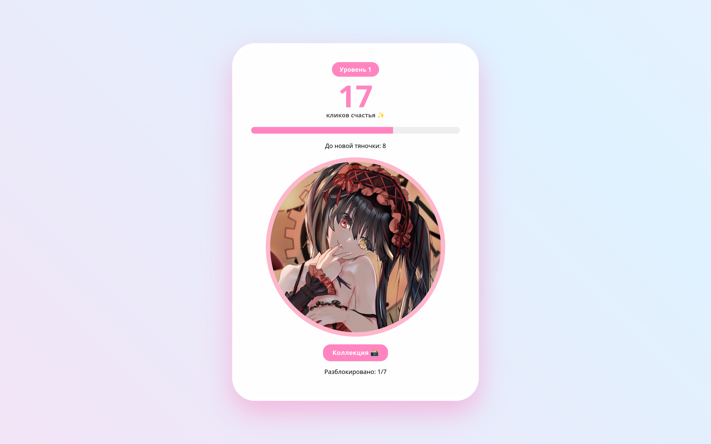
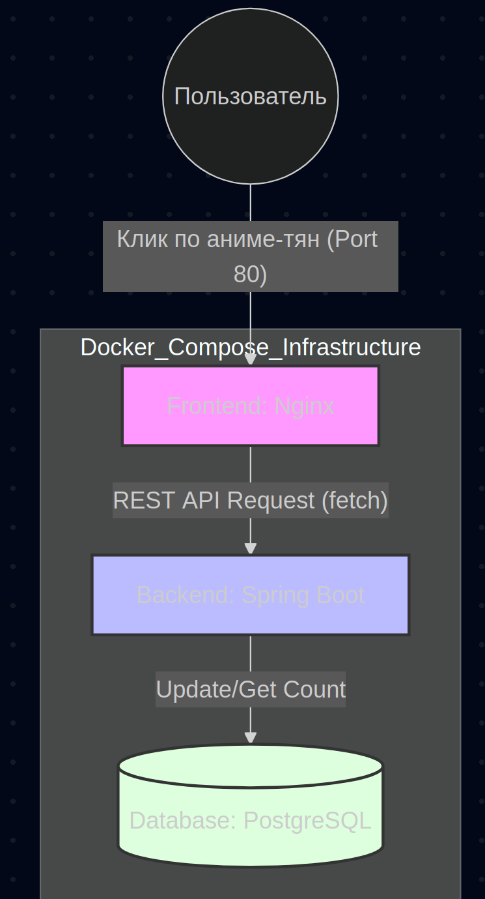

# 🌸 Лабораторная работа №3: Kawaii Anime Clicker 🌸

## 📝 Ответы на вопросы (Теория)

### 1. Зачем нужны Java и Docker?
*   **Java**: Чем больше умных паттернов знаешь, тем проще отправдать своё зп.
*   **Docker**: Платформонезависимость, быстро развернул, быстро свернул, удобство.

### 2. Почему я захотел быть программистом?
Пупупу, я хз, в детстве захотел стать, было интересно занииматься этим, щас прикольно всякие модели учить и знание матеши применять в проге.  

### 3. Почему я (мы) ненавидим Windows и продукты Microsoft?
Ну винда мусор, 1000 и 1 (не)нужное обновление, никакой стабильности, куча слежек, нет нормального терминала, да на убунту банально удобнее. Ну и ещё у тебя все права есть.

### 4. Интересы моего любимого преподавателя
Из конспекта сегодняшней лекции по джаве: "топ 5 аниме по мнению van rebuild"

    csm фильм (арка резы)
    врата штейна
    мадока
    повар боец сома
    (не) евангелеон
    (не) гурен лаган
    лилуш (aka code gay ass)
    date a live (waifu: kurumi)
    (не) фрирен
    монолог формацевта
Из персов часто мелькали Куруми (вайфу ван ребилда), нахида, на аватарочке ещё Альбедо, и мб нравится макима?

---

## 🎨 Идея проекта: Kawaii Anime Clicker
Я решил отойти от скучных "ToDo листов" и сделал геймифицированную кликалку.
**Фишки:**
- **Прогресс**: С каждым уровнем (каждые 25 кликов) открывается новая тяночка.
- **Коллекция**: Модальное окно с галереей всех разблокированных персонажей.
- **Интерактив**: Летящие сердечки при каждом клике и динамичный градиентный фон.

---

## 🏗 Инфраструктура (Блок-схема)

